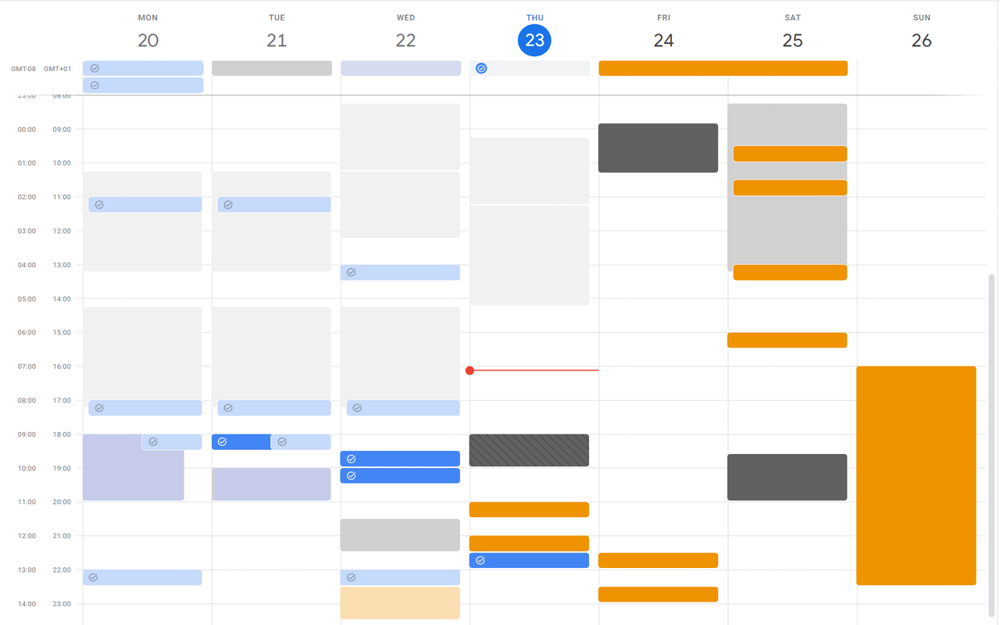

  

    
  

  <h1>Clear Calendar</h1>
  
A Chromium extension that lets you turn off event titles in Google Calendar

  

    
  

  

    Download:
     
    <a href="https://chrome.google.com/webstore/detail/clear-calendar/igokphnjmioaekmakimhfopjkleneooa">Chrome Web Store</a>
    |
    <a href="https://github.com/EndBug/clear-calendar/releases">GitHub</a>
  

## Screenshots

